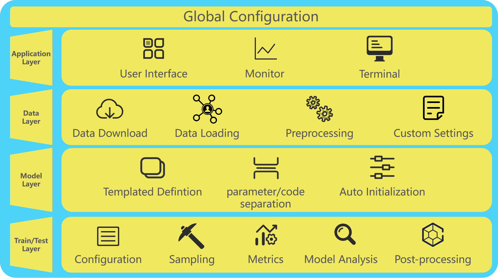
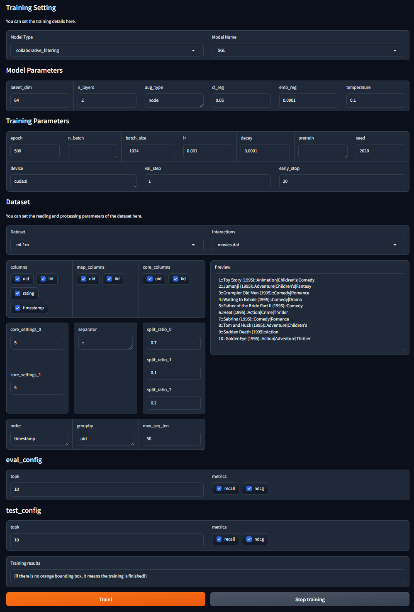
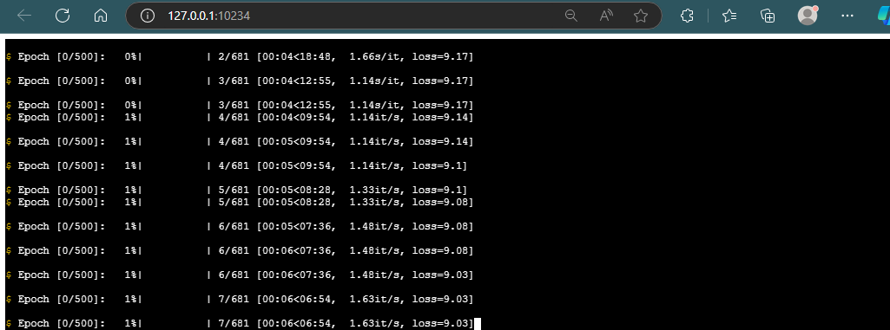

<!--
 * @Description: 
 * @Author: Rigel Ma
 * @Date: 2024-04-17 16:41:31
 * @LastEditors: Rigel Ma
 * @LastEditTime: 2024-04-22 22:16:00
 * @FilePath: README.md
-->
# XdeRec



XdeRec is an integrated recommendation framework based on PyTorch, including data processing, model training, model inference and other basic functions. The feature of our framework is that it is more convenient for users to add custom models. We have highly encapsulated the model, users only need to follow the template to fill in some basic functions of the model, and then starting the whole training process!

Now, XdeRec covers the following major recommendation tasks:
 - Collaborative Filtering
 - ...

## Features
 - Source data. All datasets we obtained originate from official sources, and the specifics of the preprocessing for each dataset are outlined within the codes.
 - Lightweight realization. We've optimized the code structure to ensure that each process runs as efficiently as possible. Test results indicate that the single-epoch training time is less in our framework compared to others.

## News

09/24/2024: We provide a front-end page for the training programme, which makes it easier to set parameters and train with one click! Currently, we are only visualising the training process, and in the future, we will add a visual testing session to provide further convenience for other domain users.

04/17/2024: The basic training functions have been realized.

04/17/2024: Add three models: SGL, SimGCL and XSimGCL


## Usage

### Training
If you want to train the model using command line, please configure the config file and then implement:
```python
python main.py --config ./config/train.json
```
The front-end visualisation of training panel is available!
```python
python ui.py
```

## Display


